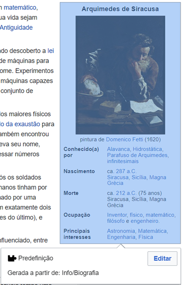

(Templates)=
# Templates ou Predefinições

Alguns estilos ou conteúdos são usados em várias páginas e, portanto, seria trabalhoso ficar copiando os códigos de formatação necessários a cada vez que fosse necessário replicar aquele estilo ou conteúdo. Assim, o MediaWiki permite salvar esse estilo ou conteúdo como um [template ou predefinição](https://www.mediawiki.org/wiki/Help:Templates).

Um exemplo são as páginas sobre indivíduos na Wikipédia, que costumam conter uma ficha sobre a pessoa. Na página sobre Arquimedes, nota-se que essa ficha é uma predefinição chamada Info/Biografia.

## Criando um template

Para criar um template, basta criar uma página normal cujo título tem o prefixo *Predefinição:*.

## Baixando template de outra wiki

A forma mais simples de conseguir um template usado em outra wiki é usando a página *Special:Export* dessa wiki para exportar a página do template como um arquivo XML e importando esse arquivo na página *Special:Import* da sua própria wiki. Mais detalhes sobre exportação e importação são dados na seção de [Exportação e Importação](./ExportImport.md).

## Utilizando o template

Para utilizar um template que já foi criado ou importado para a sua wiki:

### Na edição wikitext

Para inserir um template, basta escrever **\{\{NomeDoTemplate\}\}**. No caso do Info/Biografia, bastaria escrever \{\{Info/Biografia\}\}.

No entanto, na maioria dos templates o conteúdo não é sempre o mesmo, ele muda de artigo para artigo. No caso da Info/Biografia, as informações exibidas (nome, figura, conhecido(a) por, nascimento, morte, ocupação e principais interesses) serão diferentes em cada artigo, de acordo com as informações do indivíduo ao qual o artigo se refere. Por isso, um template pode ter **parâmetros**. Quando há parâmetros a serem definidos, escreve-se **\{\{NomeDoTemplate|Parâmetro1=Valor1|Parâmetro2=Valor2...\}\}**.

Para descobrir os parâmetros de um template, pode-se visitar a página dele, que pode conter toda a documentação sobre quais parâmetros existem e também exemplo de uso, mas isso depende de a documentação ter sido escrita ou importada. No caso da Info/Biografia, a documentação pode ser encontrada na sua respectiva [página](https://pt.wikipedia.org/wiki/Predefini%C3%A7%C3%A3o:Info/Biografia). É mostrado que há, por exemplo, os parâmetros nome, nacionalidade, nome_pai. Portanto, esse template poderia ser usado como **\{\{Info/Biografia|nome=Fulano|nacionalidade=Brasileiro|nome_pai=Ciclano\}\}**

### Na edição visual

No editor visual, basta clicar em *Inserir*, *Modelo* e digitar o nome do template. Uma janela será exibida para inserir os valores dos parâmetros.

